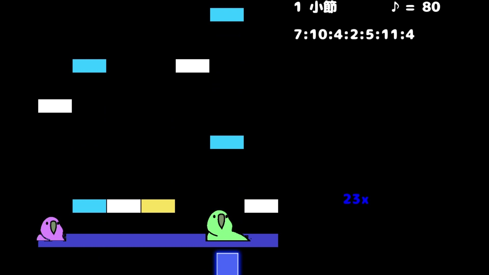

# Polylyly7k
[ポリリリリズム (なまり&すなじろ, 2024/04/26)](https://unityroom.com/games/polylylyrhythm) の7k版

[](https://drive.google.com/file/d/1F-Q2kl8MxyGOexGLVMcjioCW2emN_0T3/view?usp=sharing)

## 素材
- 音源: [魔王魂](https://maou.audio/)
- スキン(一部): [Beatoraja ModernChic](https://www.kasacontent.com/)
- フォント: [にくまるフォント](http://www.fontna.com/blog/1651/)

# Play
```sh
pip install pygame numpy
python3 ./poly7k.py
```

- BPMは200行目の引数いじってちょ
- キーコンフィグは47行目

2024/05/06
